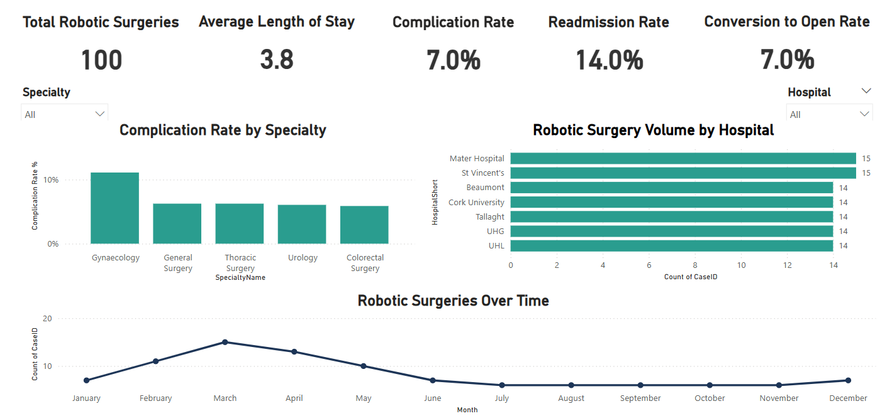
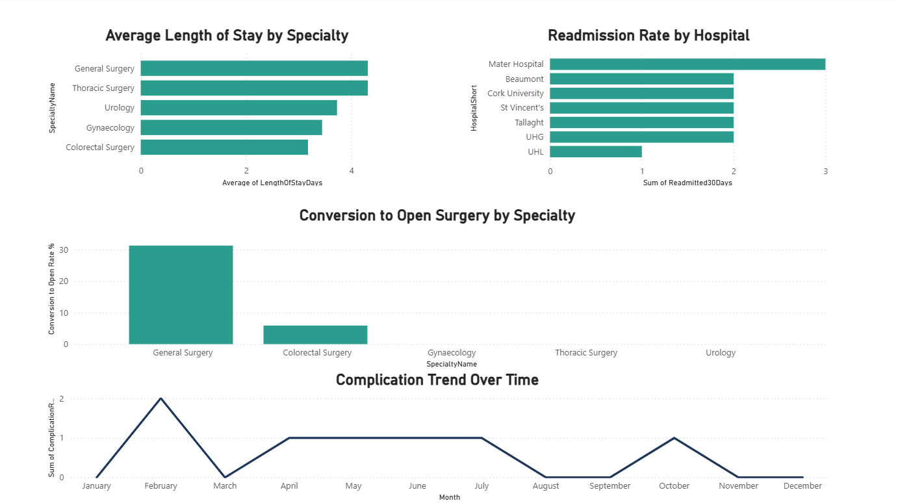

# 🤖 Robotic Surgery Audit Analytics

Healthcare audit and analytics portfolio project focused on robotic-assisted surgery governance, operational reporting, and clinical performance monitoring.

---

## 📌 Project Overview

This project simulates a healthcare governance and robotic surgery audit reporting environment designed to support operational oversight, performance monitoring, and data-driven decision-making.

The project is inspired by real-world healthcare analytics and clinical audit environments, including surgical performance monitoring, hospital reporting, and governance frameworks used within modern healthcare systems.

---

## 📊 Dashboard Screenshots

### Executive Overview Dashboard

### Clinical & Governance Analysis Dashboard

---

## 🎯 Project Objectives

- Design a relational SQL database for robotic surgery audit data
- Create realistic synthetic healthcare datasets
- Analyse surgical activity and outcomes
- Develop operational and governance-focused KPIs
- Build dashboards and reporting outputs using Power BI
- Demonstrate practical skills in SQL, data analysis, reporting, and healthcare operations

---

## ✅ Key Dashboard Features

- 📈 Executive KPI reporting
- ⚠️ Complication rate monitoring
- 🏥 Readmission analysis
- 🔄 Conversion-to-open surgery tracking
- ⏱️ Length of stay analysis
- 📊 Hospital performance comparison
- 📅 Surgical activity trend reporting
- 🎛️ Interactive Power BI filtering and slicing
  
---

## 🗂️ Project Components

### Database Design
- Hospitals
- Surgical Procedures
- Surgeons
- Patient Cases
- Outcomes
- Governance & Training Records

### Reporting & Analytics
- Surgical volume reporting
- Complication tracking
- Length of stay analysis
- Hospital performance comparisons
- Governance KPI dashboards

---

## 🛠️ Technologies

- SQL Server
- Power BI
- Excel
- Python (future analytical expansion planned)

---

## 💡 Skills Demonstrated

- SQL database design
- Healthcare data modelling
- Power BI dashboard development
- DAX measure creation
- KPI reporting
- Data visualisation
- Operational analytics
- Governance reporting
- Synthetic healthcare dataset generation

---

## 📁 Repository Structure

| Folder | Purpose |
|---|---|
| documentation | Project planning and design documents |
| sql | Database creation scripts and SQL queries |
| data | Synthetic datasets and exports |
| dashboards | Power BI dashboards and reporting |
| images | Screenshots, diagrams, and visual assets |

---

## 🚧 Status

Core SQL database development, synthetic healthcare audit dataset generation, and multi-page Power BI dashboard reporting have been completed.

The project demonstrates healthcare governance analytics, KPI reporting, operational monitoring, and clinical audit-focused dashboard design within a simulated robotic surgery reporting environment.
